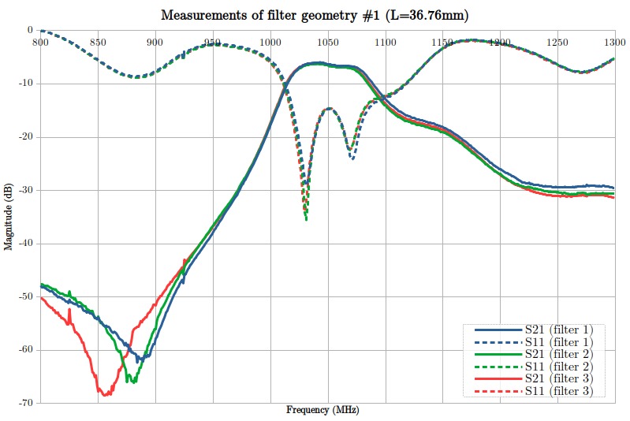

# DIY RF Network Analyser

This repository contains files and instructions to build a crude $50 RF Network Analyser (NA) with a tracking generator from two RTL-SDRs, a PLL synth and a VSWR bridge. This device is very simple to put together (no soldering required) and gives quite reliable measurements for custom antennas or filter design, for instance.

It is controlled by a Python script through a command-line interface. It has a dynamic range of about 50dB and a bandwidth of 35 to 1700MHz.

*Note: using a noise source instead of the signal generator is a simpler way of getting those measurements. The only drawback is the reduction of the dynamic range of the SDR due to the amount of noise that may overwhelm the receivers.*

## Material

This is the full BOM. Prices are from AliExpress:

| Quantity | Item                         | Estimated cost/u |
|----------|------------------------------|------------------|
| 1        | Arduino Nano                 | $2               |
| 1        | Bidirectionnal level shifter | $1               |
| 1        | ADF4351 evaluation board     | $18              |
| 1        | VSWR bridge                  | $14              |
| 1        | SMA 50&Omega; load           | $5               |
| 4        | SMA cable                    | $2               |
| 1        | SMA female-female transition | $2               |
| 2        | RTL-SDR (TCXO/SMA version)   | $15              |

## Build instructions

1. Wire the electronics as shown on the diagram:

2. Flash the "Arduino_Synth" program on the Arduino Nano.
3. Connect both SDRs and the Arduino to the host computer.

## Usage

1. Disconnect both DUT ports, and launch an "open" measurement for calibration: `python3 NA.py > open.csv`
2. Connect both DUT ports together with the female-female transition, and launch an "thru" measurement for calibration: `python3 NA.py > thru.csv`
3. Connect the DUT and perform the measurement: `python3 NA.py -o open.csv -t thru.csv | tee output.csv`
4. You can plot the output csv file with LibreOffice Calc or Octave, for instance.

For single port devices (such as antennas), only the "open" calibration is necessary.

For help on the parameters, use `python3 NA.py -h`

## Sample output

This is a typical output plot:

